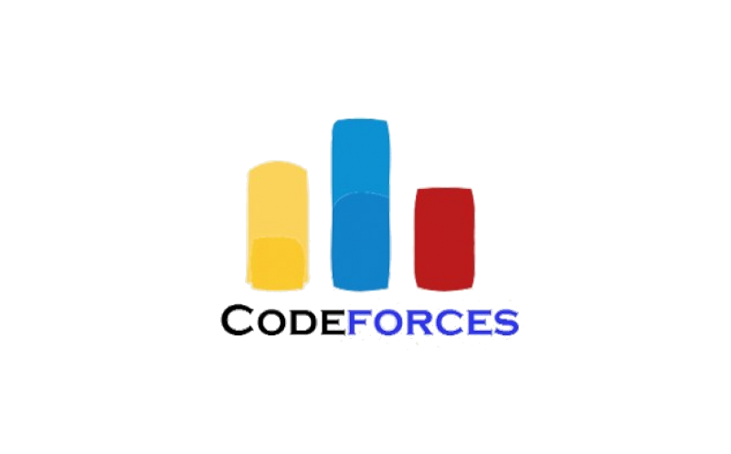

<h1 align="center">
  
  Hi, I'm Sahil Sahney
</h1>

  

<!-- Intro Section -->

## Welcome to the backend.

I’m a **Backend & Full Stack Developer** — focused on building systems that scale, fail gracefully, and are easy to reason about.  
I care about **clean APIs**, **solid data models**, and **code that other developers can actually maintain**.

🧠 **Logic?** Structured.  
⚙️ **APIs?** Designed and tested.  
🚀 **Systems?** Built to grow.

 

**Open source** isn’t a side hobby — it’s how I learn, contribute, and get better.

<!-- 🌐 Connect with Me -->
<!-- 🌐 Connect with Me -->
<h2 align="center">Connect with me</h2>

<table align="center">
  <tr>
    <!-- LinkedIn -->
    <td align="center" width="80">
      
    </td>
    <td align="center" width="80">
      
    </td>
    <td align="center" width="80">
      
    </td>
   <!-- CodeChef -->
<td align="center" width="80">
  
</td>
  </tr>
</table>

### 👁 What I’m About

- 🧠 Backend-first thinking with full-stack execution  
- 🧰 Designing **scalable APIs**, data models, and maintainable systems  
- 🌱 Building things, breaking assumptions, improving iteratively  
- 🤝 Open source contributions, real-world codebases, continuous learning

### 💻 Tech Stack

<!--
**sahilsahni18/sahilsahni18** is a ✨ _special_ ✨ repository because its `README.md` (this file) appears on your GitHub profile.

Here are some ideas to get you started:

- 🔭 I’m currently working on ...
- 🌱 I’m currently learning ...
- 👯 I’m looking to collaborate on ...
- 🤔 I’m looking for help with ...
- 💬 Ask me about ...
- 📫 How to reach me: ...
- 😄 Pronouns: ...
- ⚡ Fun fact: ...
-->
